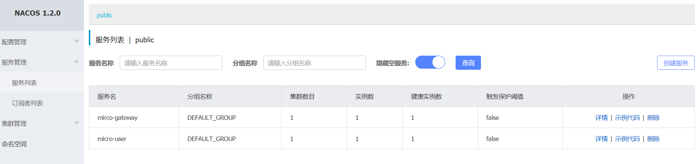
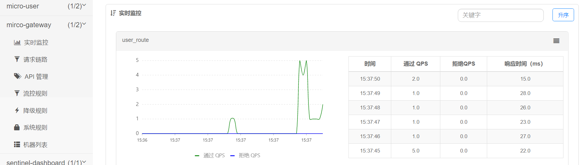
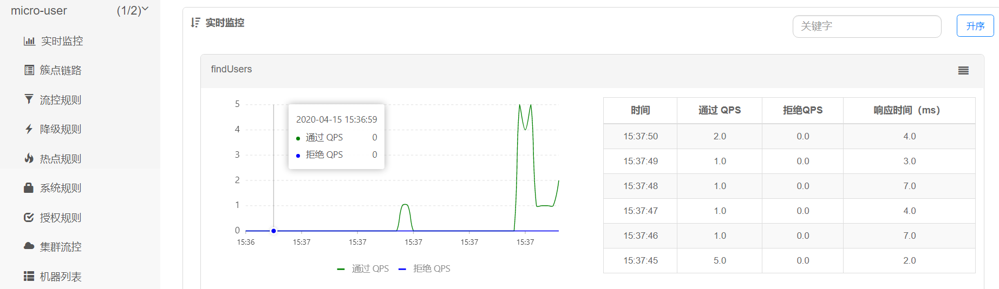

## Micro-sample

### 项目集成
- [x] Spring Cloud Gateway
- [x] Spring Cloud Sentinel
- [x] Spring Cloud Nacos
- [x] Spring Cloud Nacos Config
- [x] ~~Sharding JDBC~~
- [x] Spring Boot Mybatis
- [x] Spring Boot Data JPA
- [x] Spring Boot Open Fegin
> 删除Sharding-JDBC数据库中间件，改为分布式数据库CockroachDB。对于小型项目可以使用
> Sharding-JDBC进行读写分离，也相当于容灾备份。

### 简介
初步微服务架构集成已经完成，待后期对架构当中细节进行调整优化。架构当中使用Gateway配合Sentinel进行路由的转发以及监控，以Nacos作为注册中心，同时使用Nacso Config作为配置，还需要很大的调整。集成当当网Sharding-JDBC进行数据库读写分离，当前并没有做分库分表。使用Spring Data JPA与数据库进行关系映射，解放手动创建表结构，鉴于Mybatis比较流行，遂集成做数据库的读写操作。使用Open Fegin进行服务之间的调用，并未采用Alibaba Dubbo RPC框架，考虑到Dubbo框架上手需要一定的学习曲线，另外普通的HTTP Client满足目前的API请求，性能上可能略次于Dubbo。
### 安装CockroachDB集群
我使用的是非安全模式启动的，生产环境可以生成证书使用安全模式。

1. 启动节点1
```
# 非安全模式
cockroach start --insecure --host=localhost
```
2. 启动节点2
```
cockroach start --insecure --store=node2 --host=localhost --port=26258 --http-port=8081 --join=localhost:26257
```
> 这里的`--join`是与节点1相关联。
3. 启动节点3
```
cockroach start --insecure --store=node3 --host=localhost --port=26259 --http-port=8082 --join=localhost:26257
```
> 这里的`--join`也是与节点1相关联。

官方文档[CockroachDB文档](http://doc.cockroachchina.baidu.com/#quick-start/start-a-local-cluster/from-binary/)
### 运行
1. 启动Naos
```
./startup.sh // startup.cmd
```
>Nacos注册中心地址默认127.0.0.1:8848 

2. 启动Micro-user服务
3. 启动Micro-gateway服务
4. 启动Sentinel

下载Sentinel控制台jar包

```
java -Dserver.port=8080 -Dcsp.sentinel.dashboard.server=localhost:8080 -Dproject.name=sentinel-dashboard -jar sentinel-dashboard-1.7.2.jar
```
> Sentinel应用的端口是8080，HTTP API Server 的端口号8719

5. 访问接口地址
- 网关接口地址为`http://localhost:4040/api/user`
- 服务接口地址为`http://localhost:2020/api/user`

6. 刷新请求接口进行Sentinel测试






### Sharding JDBC
当运行查询操作的时候，可以在控制台看到输出信息
```
2020-04-15 16:23:54.304  INFO 10220 --- [nio-2020-exec-1] ShardingSphere-SQL                       : SQL: select * from user ::: DataSources: slave0
```
slave0即我们配置的从数据库。

> 主从数据库搭建参考